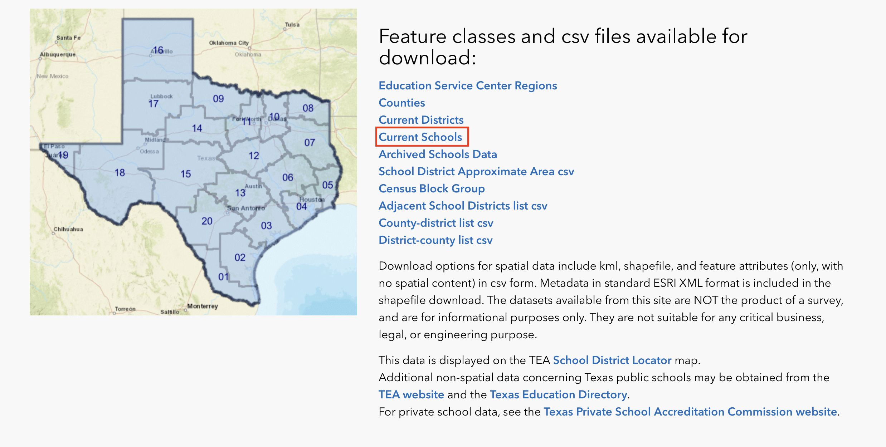
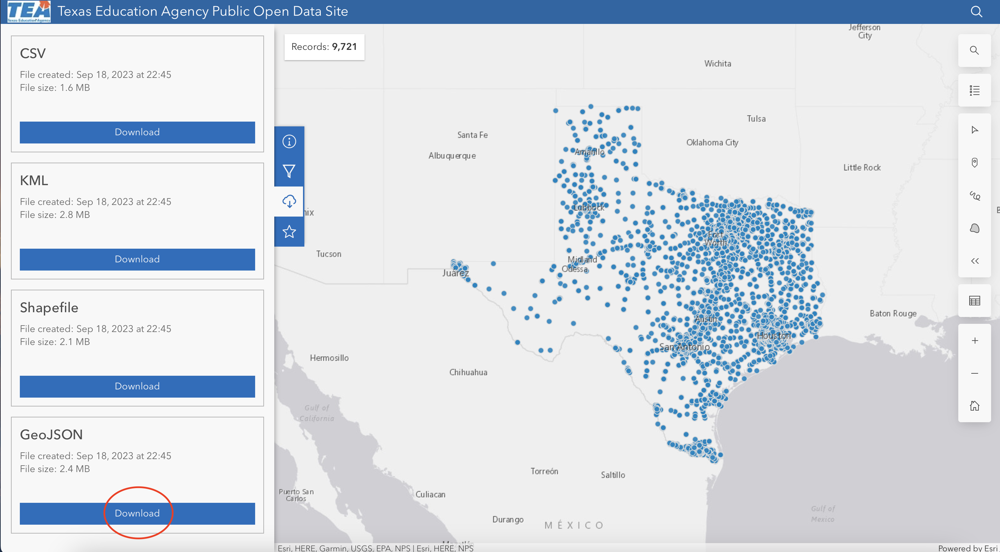
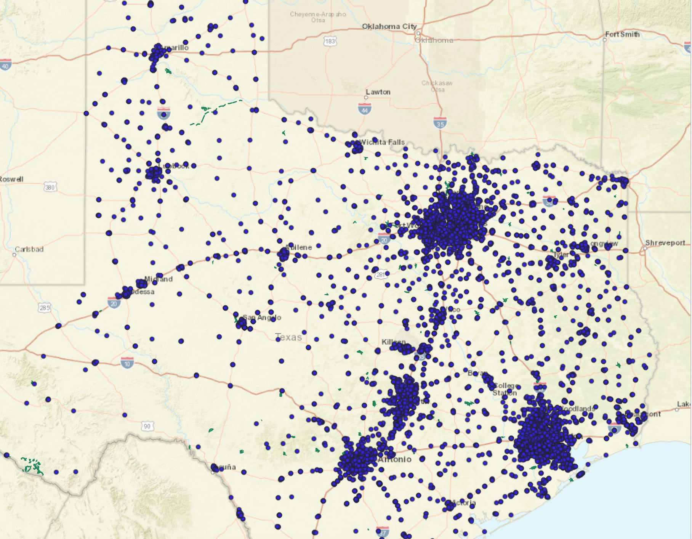
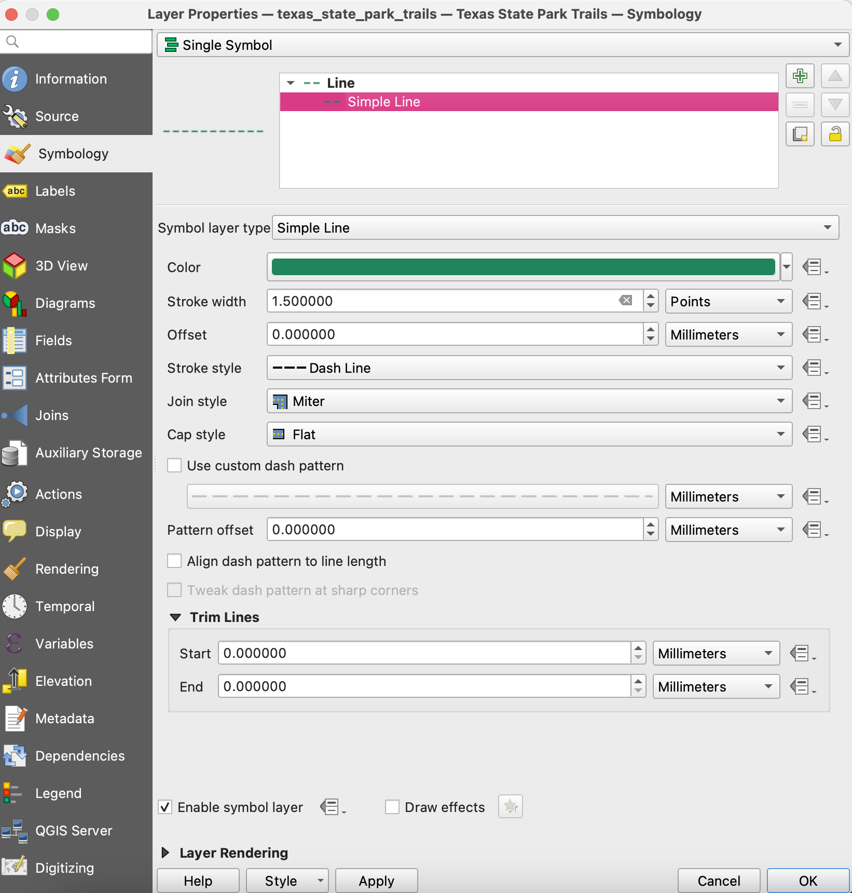
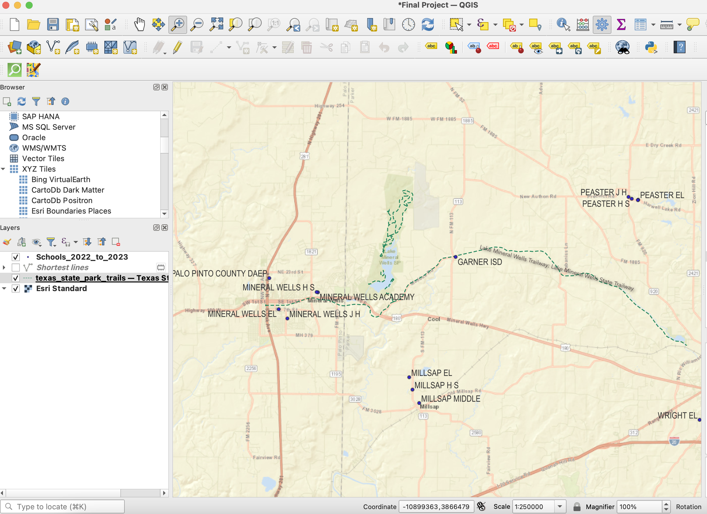
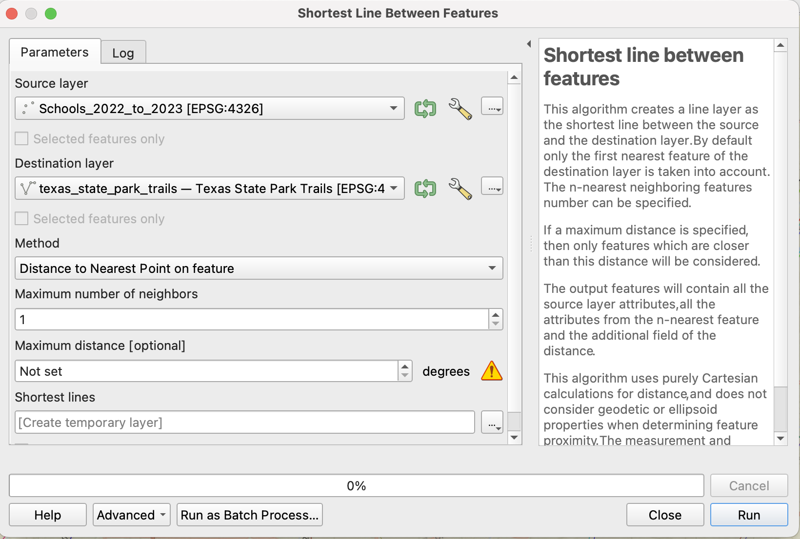
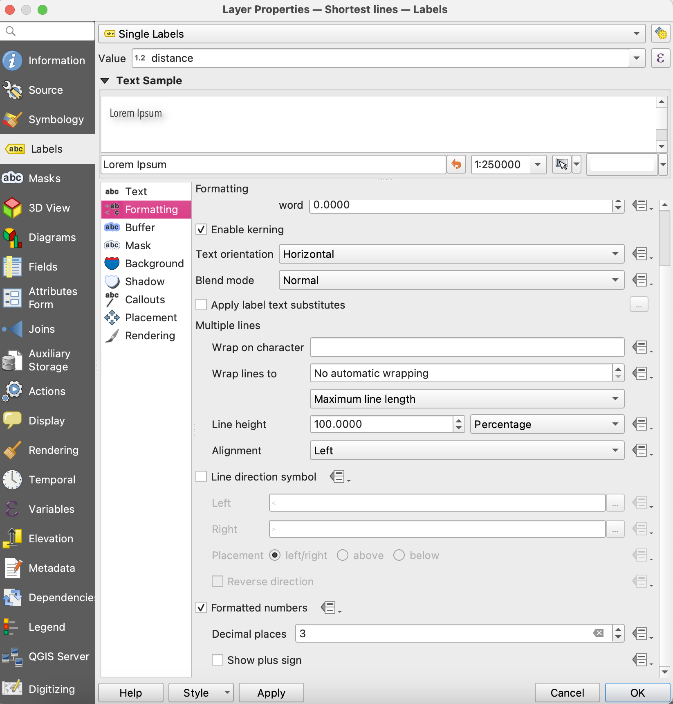
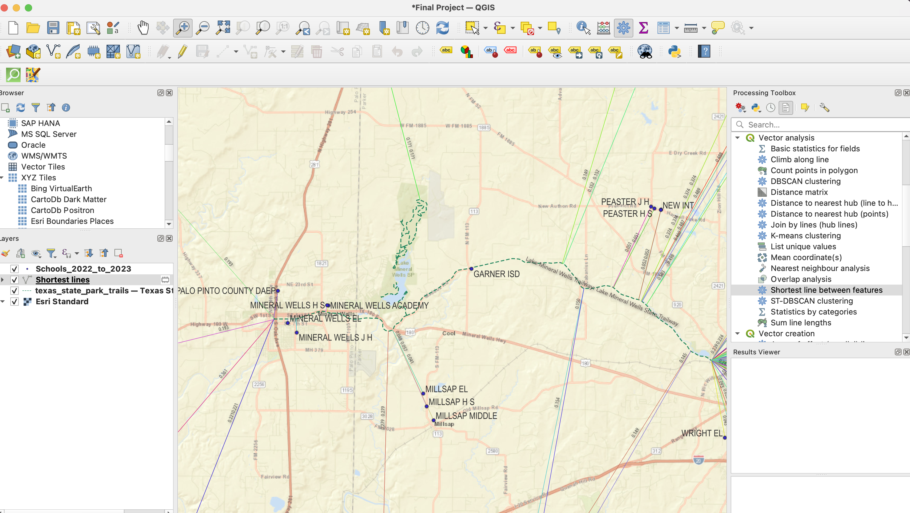
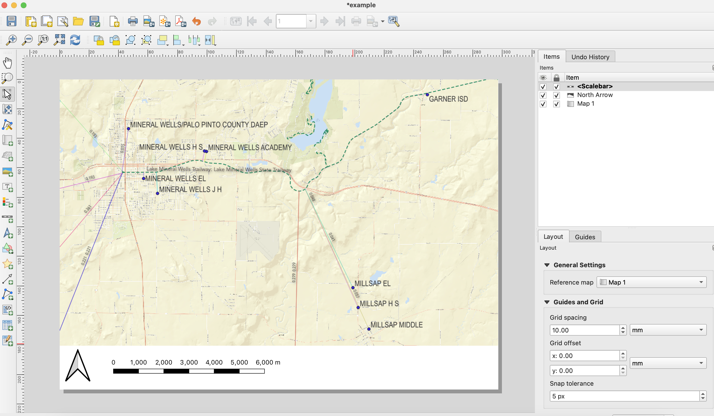

# Mineral Wells Schools and Trails
Map of school locations and hikes in and around Mineral Wells, TX.

## Project Contents

- [Data Source](#data-source)
- [Project Background](#project-background)
- [Purpose](#purpose)
- [Mapmaking Process](#mapmaking-process)
- [Map Summary](#map-summary)
- [Final Project Link](#final-project-link)

***

### Data Source

[Link to school data](https://schoolsdata2-tea-texas.opendata.arcgis.com)
[Link to trail data](https://tpwd.texas.gov/state-parks/park-information/maps/use-the-trails-maps-anytime-anywhere)

### Project Background

This project was designed with Texas data on school locations and Texas State Park trails. To reduce the scope of the project, it was limited to Mineral Wells. The choice to limit to Mineral Wells was mostly because my family used to visit Mineral Wells State Park multiple times a year to go hiking and camping.

### Purpose

The purpose of this project was to map the locations of all schools and hiking trails in and surrounding Mineral Wells to find the distances between schools and hiking trails. 

### Mapmaking Process

To start the map first go to the data sites to download your data. 
To download the Texas State Park trail data simply click on the kmz file link and download to your computer.
To dowload the school data, click on the 'current schools' option. If you want to explore mapping any other options, feel free to do so.

 
 *Click on current schools option*

Once you have clicked on the correct tab you will see this selection:

*Click on the GeoJSON file download*

Once you have both these files downloaded, open the QGIS Software. 
Start a new project in QGIS and under *XYZ Tiles* select the *ESRI Standard* map format. Then import the Trail data kmz file and the School data GeoJSON file.

If you set the view to the whole state of Texas you will have a lot of data on the screen so to simplify, set your scale to 1:100000 at the greatest and pick an area in Texas that you would like to focus on. For this example, we will be focused on the Mineral Wells area.

*Data viewed throughout the state of Texas*

Once you have selected your area of focus, format the school points and trail. You can do this by right clicking on the layer and selecting *properties*. 
For the trails layer, I would suggest editing the line properties. Go to *symbology* and select *single symbol*. Choose a color that represents trails and select the stroke style *dash line*.

For the school points, leave the symbology as it is and select a color that you feel represents schools.
Once you have the symbology of your layers finalized, it is time to add names!
Find the properties window for the Texas Trails layer and click on *labels*. Click on *single labels* and set the value as *Name*. Then select the font type, size, and color. To help the trail names stand out, you can add a drop shadow. 
Some of the trail names may not be visible with the 1:100000 scale. This is okay based on the purpose of our static map, however if you would like to create a zoomable map you can set them to show up based on scale under the *rendering* tab.
Follow the same steps with the School layers. You should get something that looks like this:

Now, we need to find out how far away the schools are from the nearest trail. 
To do this, select the Texas trails layer. Then, find the *shortest line between features* option under the *Vector Analysis* tab in the Processing Toolbox. 
Select the source layer as the schools and the destination layer as your trails. This is how the paramters should look before you hit Run.

Now we need to work on the properties of the lines. Open the layer properties and click on *symbology*. Select the categorized option and set the value as distance. For the color, select random colors and click on *classify*. You should see the values of all the line distances, each represented by different colors.
Now, click on the *labels* and select single labels. Set the value as distance and format the text how you would like. Because the distances are written out to 10 decimals, we need to shorten them to be able to show on the map. Click on the *formatting* tab and check the formatted numbers option. You can choose how many decimal places you want to show, I chose 3.

*Formatting for the distance of the lines*

This should be similar to what your map currently looks like

Now, we need to finalize this map as a static image. 
Select Project, then *New Print Layout*.
Add your map to the layout and lock the layer. Then add your North Arrow and Scale to the map. Make sure your scale uses the same measurements as your line distances (meters). It should look similar to this:

Now, we need to add the legend. When you add the legend, it will show all the lines for the entire state of Texas. To only show the lines in the map frame, open the Item Properties. Select the option to *only show items inside linked map*. This will cause the legend to only show the lines currently in frame. If you want to keep those labels, you can name each line *distance from "school" to "trail". Or you can remove the lines from the legend as the distances are already labeled in the map. 

The final thing to do is to title the map and include the metadata details of your map.
Once your map is finalized, export the image as a jpg. Please export two versions: one at 600dpi and one at 1200dpi.

### Map summary

THis map allows you to see how close schools are to nature areas such as hiking trails in Mineral Wells, Texas. In creating this map, you are able to see if there is a pattern to the distance between schools and hiking trails across Texas. While this may seem like an unusual comparison, there are several different ways you can analyze this map and further directions where this data can be applied. 
The overall mapmaking process is quite simple but can be used in a variety of ways, allowing for a lot of creativity.

## Final Project Link

Here you are linking from the README.md to the index.html.

Please view the [final map online](http://127.0.0.1:5500/index.html)

