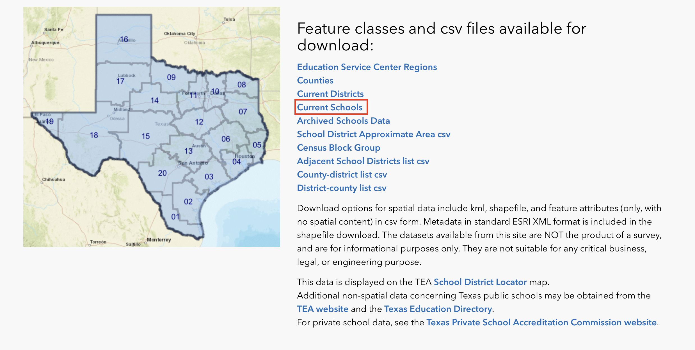

# Mineral Wells Schools and Trails
Map of school locations and hikes in and around Mineral Wells, TX.

## Project Contents

- [Data Source](#data-source)
- [Project Background](#project-background)
- ....

***

### Data Source

[Link to school data](https://schoolsdata2-tea-texas.opendata.arcgis.com)
[Link to trail data](https://tpwd.texas.gov/state-parks/park-information/maps/use-the-trails-maps-anytime-anywhere)

### Project Background

This project was designed with Texas data on school locations and Texas State Park trails. To reduce the scope of the project, it was limited to Mineral Wells. The choice to limit to Mineral Wells was mostly because my family used to visit Mineral Wells State Park multiple times a year to go hiking and camping.

### Purpose

The purpose of this project was to map the locations of all schools and hiking trails in and surrounding Mineral Wells to find the distances between schools and hiking trails. 

### Mapmaking Process

To start the map first go to the data sites to download your data. 
To download the Texas State Park trail data simply click on the kmz file link and download to your computer.
To dowload the school data, click on the 'current schools' option. If you want to explore mapping any other options, feel free to do so.

*Click on current schools option* 

You can describe the mapmapking process in this section, including images where it helps to describe the process.

You can also use some lists, and here's some formatting ideas.

1. **Example bold**
2. *Example italics*
3. 
4. 

### Map summary

What are the key findings to take from your map and the overall mapmaking process?

## Final Project Link

Here you are linking from the README.md to the index.html.

Please view the [final map online](www.github...)
